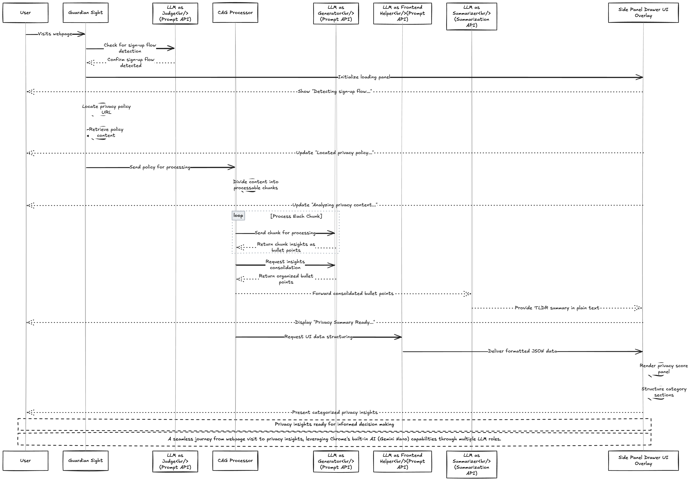

# Guardian Sight - Your Privacy, Simplified!

🛡️ Transform complex privacy policies into instant insights using Chrome's built-in AI (Gemini Nano).

Automatically detect sign-ups, analyze privacy terms in real-time, and make informed privacy decisions - all LLM insights processed locally in your browser.

[](https://www.youtube.com/watch?v=qRX8E6qNcy8)

_Watch our 3-minute demo showcasing how Guardian Sight simplifies privacy policies using Chrome's built-in AI_

> 🎥 [Watch on YouTube](https://www.youtube.com/watch?v=qRX8E6qNcy8)

Key Features:

- ⚡ Transform 10-minute reads into 30-second insights for quick, informed decisions.
- 🚀 Real-time privacy policy detection and analysis
- 🎯 Color-coded privacy risk assessments
- 🔒 Local processing with Chrome's built-in AI
- 🎨 Clear, categorized privacy breakdowns

## Prerequisites

Before you begin, make sure you have the following installed:

- Node.js (recommended version 16.x or higher) -> Refer `.nvmrc` file to know current version being used. As of now, `node: 18.20.4` being used.
- npm (comes with Node.js)

## Getting Started

Follow these steps to get the boilerplate code up and running:

1. **Clone the repository:**

   ```bash
   git clone https://github.com/vivekVells/guardian-sight
   ```

2. **Navigate to the project folder:**

   ```bash
   cd guardian-sight
   ```

3. **Install dependencies:**

   ```bash
   npm install
   ```

4. **Run the development server:**

   ```bash
   npm run dev
   ```

   This command will start the development server using Vite, enabling hot module replacement and allowing you to see your changes in real.

5. **Load the extension in Chrome:**

   - Open the Chrome browser.
   - Navigate to `chrome://extensions/`.
   - Turn on the "Developer mode" toggle in the top-right corner.
   - Click the "Load unpacked" button and select the `dist` folder inside your project directory.

6. **Start Developing:**

   - The popup UI can be found in the `src/App.tsx` directory.
   - Customize the manifest template in `src/manifest.json` and let CRXJS handle the dynamic manifest generation.
   - The support for background scripts, options page, content scripts is already configured. Customise them in their respective folder.

7. **Build for Production:**

   When you're ready to publish your extension, create a production build by running:

   ```bash
   npm run build
   ```

   The optimized files will be available in the `dist` folder. You can then package this folder to distribute your extension.

## System Architecture

### Privacy Policy Analysis Flow



This diagram illustrates how Guardian Sight transforms privacy policies into actionable insights using Chrome's built-in AI capabilities through multiple LLM roles. Users receive real-time privacy analysis through our intelligent processing pipeline, from initial sign-up detection to final privacy insights presentation.

Key Components:

- LLM as Judge (Prompt API): Detects sign-up flows
- CAG Processor: Chunks and processes privacy policies
- LLM as Generator (Prompt API): Creates initial insights
- LLM as Frontend Helper (Prompt API): Structures data for UI
- LLM as Summarizer (Summarization API): Generates TLDR summaries

## Real-World Privacy Analysis Examples

Guardian Sight in action across various sign-up flows, demonstrating its versatility and effectiveness in analyzing privacy policies from different services.

### Google Account Creation


_Analysis of Google's privacy policy during account creation, highlighting key privacy implications._

### Claude AI Privacy Analysis


_Privacy analysis of Claude AI's sign-up flow, showing comprehensive insights into data handling practices._

### Facebook Sign-up Flow


_Breakdown of Facebook's privacy practices during new account registration._

### Cronitor.io Registration


_Privacy analysis of Cronitor.io's sign-up process, demonstrating our tool's effectiveness with SaaS platforms._

Each analysis showcases:

- Real-time privacy policy detection
- Comprehensive privacy insights
- Color-coded risk assessments
- Category-specific breakdowns
- TLDR summaries for quick understanding

---

## Contributing

We welcome contributions to enhance Guardian Sight! Here's how you can get involved:

1. **Report Issues**: Found a bug or have a feature request? Open an issue on our [GitHub Issues](https://github.com/vivekVells/guardian-sight/issues) page.
2. **Submit Pull Requests**: Improve the codebase or add features by creating a pull request. Ensure your contributions align with our [contributing guidelines](./CONTRIBUTING.md).

## Support Us

Enjoy using Guardian Sight? 🌟 Support our efforts by [buying us a coffee](https://buymeacoffee.com/vivekvells)! Every contribution helps us keep improving privacy awareness tools.

---
